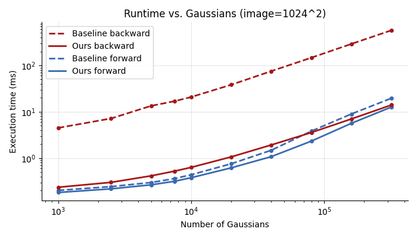
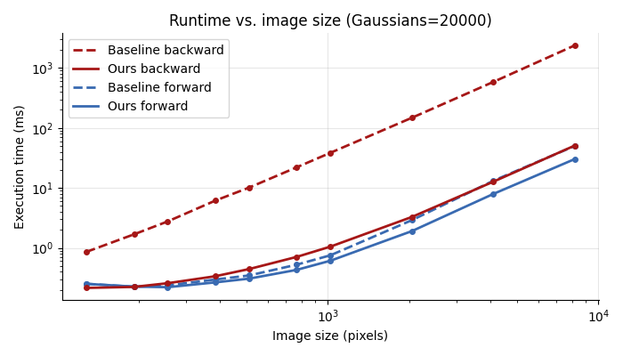

# Fast and Scalable Gaussian Splatting Rasterizer for CT projections

Fast and scalable implementation of the Gaussian Splatting rasterizer for CT projections. Implemented as a part of the paper:
> FaCT-GS: Fast and Scalable CT Reconstruction with Gaussian Splatting

### [Main Repository](https://github.com/PaPieta/fact-gs) | [Paper](https://arxiv.org/pdf/2604.01844) | [Project Page](https://papieta.github.io/fact-gs/)

#### Related repositories (applied in the paper):
[Fast Gaussian Splatting Voxelizer](https://github.com/PaPieta/gs-voxelizer) | [Fused SSIM](https://github.com/rahul-goel/fused-ssim) (2D and 3D) | [Fused 3D TV](https://github.com/PaPieta/fused-3D-tv)

## Prerequirements

1. You must have PyTorch installed with CUDA backend, and an NVIDIA GPU.
2. This repo requires [GLM](https://github.com/g-truc/glm). It will be downloaded automatically to `gs_ct_rasterizer/third_party/glm`. To provide the library from another location, set the `GLM_HOME` environment variable (`export GLM_HOME=/path/to/glm`).

Check `test/test_requirements.txt` for additional Python packages needed to run the regression and profiling scripts.

> If you plan to run the whole FaCT-GS reconstruction pipeline, it is recommended to follow the installation steps from the [Main Repository](https://github.com/PaPieta/fact-gs).


## Installation

In the cloned repository:
```
pip install . --no-build-isolation
```

## Minimal example

> Using helpers from `test/utils.py`

```python
import torch
from torch.nn import functional as F

from gs_ct_rasterizer import optim_to_render, rasterize
import utils

vol_size = 100
num_gaussians = 5_000

# Init test volume
volume = utils.generate_test_volume(vol_size)
# Initialize gaussians within the volume
pos3d, scale3d, quat, density = utils.random_gauss_init(
    num_gaussians=num_gaussians,
    vol=volume,
    device="cuda",
)

# Enable gradients
pos3d = pos3d.requires_grad_()
scale3d = scale3d.requires_grad_()
quat = quat.requires_grad_()
density = density.requires_grad_()

camera_setups = (("parallel beam", 0), ("cone beam", 1))
camera_name, camera_mode = camera_setups[0]
print(f"Camera mode: {camera_name}")
camera = utils.create_test_camera(
    image_height=192,
    image_width=192,
    mode=camera_mode,
    device="cuda",
)

tanfovx, tanfovy = utils.camera_tan_fovs(camera)
# Convert to rendering parameters
pos2d_buffer = torch.empty(
    (*pos3d.shape[:-1], 2),
    device=pos3d.device,
    dtype=pos3d.dtype,
).requires_grad_(True)
pos2d, conics_mu, radii, tile_min, tile_max, num_tiles_hit = optim_to_render.optim_to_render(
    pos3d,
    scale3d,
    quat,
    density,
    camera.world_view_transform,
    camera.full_proj_transform,
    tanfovx,
    tanfovy,
    camera.image_height,
    camera.image_width,
    camera.mode,
    pos2d_buffer=pos2d_buffer,
)
# Rasterize gaussians
rendered = rasterize.rasterize_gaussians(
    pos2d,
    conics_mu,
    density,
    tile_min,
    tile_max,
    num_tiles_hit,
    camera.image_height,
    camera.image_width,
).permute(2, 0, 1)

# Sample target image and optimize
target = utils.random_target_image(
    camera.image_height, camera.image_width, 1, device=rendered.device
)
loss = F.mse_loss(rendered, target)
loss.backward()
```


### Note!

Rasterizer supports both parallel-beam and cone-beam CT settings, as well as up to 4 channels. The paper and performance tests only cover running it in the 1-channel version.

## Performance Comparison

Baseline is sourced from [r2_gaussian](https://github.com/Ruyi-Zha/r2_gaussian/tree/main/r2_gaussian/submodules/xray-gaussian-rasterization-voxelization).

 

## Citation

If this repository helped in your research, please consider citing our work:
```
@misc{pieta2026factgsfastscalablect,
      title={FaCT-GS: Fast and Scalable CT Reconstruction with Gaussian Splatting}, 
      author={Pawel Tomasz Pieta and Rasmus Juul Pedersen and Sina Borgi and Jakob Sauer Jørgensen and Jens Wenzel Andreasen and Vedrana Andersen Dahl},
      year={2026},
      eprint={2604.01844},
      archivePrefix={arXiv},
      primaryClass={cs.CV},
      url={https://arxiv.org/abs/2604.01844}, 
}
```

## Acknowledgements

Codebase adapted from [image-gs](https://github.com/NYU-ICL/image-gs). Implementations inspired by [r2_gaussian](https://github.com/Ruyi-Zha/r2_gaussian/tree/main/r2_gaussian/submodules/xray-gaussian-rasterization-voxelization), [taming-3dgs](https://github.com/humansensinglab/taming-3dgs), [StopThePop](https://github.com/r4dl/StopThePop).

## LICENSE

MIT License (see LICENSE file).
